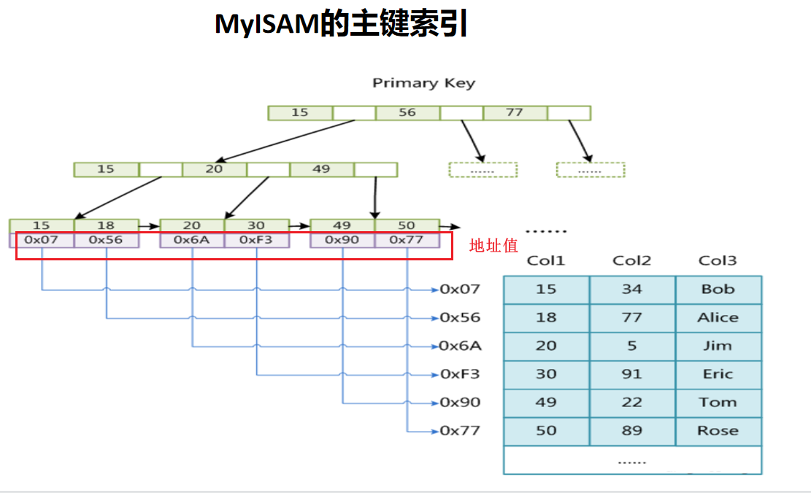

# 数据库提高

## DBDay01

### 一、事务

#### 1、基本概念

概念：构成单一逻辑工作单元的操作集合，即：一组命令的集合。


#### 2、性质ACID（重要）

原子性：事务中的操作为一个整体，要么都做，要么都不做。

一致性：事务的执行的前后，数据的完整性保持一致。且事务执行前后数据的总和不变。

隔离性：**一个事务的执行不能被其他事务干扰**。即一个事物内部的操作及使用的数据对并发的其他事务是隔离的，并发执行的各个事物之间不能互相干扰。（隔离性与隔离级别有关系。隔离性不可能达到100%）

持久性：指一个事物一旦提交，它对数据库中数据的改变就应该是永久性的。


#### 3、事务的基本操作

```sql
#事务的开始
start transaction
begin

#事务的提交
commit

#事务的回滚（回到某个起始状态或者称为回滚点）
rollback  #默认情况会回滚到事务开始之前的状态，如果设置了回滚点，就会回到指定回滚点的位置。

rollback to sp1;

#设置回滚点
savepoint + 回滚点的名字

#事务的异常中断，相当于事务完全没有执行是一样的效果。
```


```sql
#查看数据库中表中的字段
desc customer;
show create table customer;

#查看数据库表中的条数
select count(*) from customer;
select count(1) from customer;

#显示表属于哪个数据库
select database();

#查看数据库的版本信息
select version();
```

#### 4、并发与并行的区别

并行：是指两个或者多个事件在同一时刻发生。（点）

并发：是指两个或者多个事件在同一时间间隔发生。（线）


### 二、并发产生的四个问题

#### 1、脏写

脏写是指当多个事务并发**写同一数据**时，先执行的事务所写的数据会被后写的**数据覆盖**


#### 2、脏读

如果一个事务A向数据库写数据，但该**事务还没提交或终止**，另一个事务B就看到了事务A写入数据库的数据


#### 3、不可重复读

一个事务有对同一个数据项的多次读取，但是在某前后两次读取之间，另一个事务更新该数据项，并且**提交**了


#### 4、幻读

一个事务需要进行前后两次统计，在这两次统计期间，另一个事务插入了新的符合统计条件的记录，并且提交了。导致前后两次统计的数据不一致。这种现象，我们称之为幻读。即：B事务前后读某张表的时候，在这个过程中A新增加了一条数据，并且已经提交，对于B事务而言，就产生了幻读。


### 三、隔离级别

读未提交、读已提交、可重复读、可串行化。（隔离性依次增高）

```sql
#查看当前事务的隔离级别
select @@ [session|global] transaction_isolation;
select @@tx_isolation;

#查询当前隔离级别
select @@session.transaction_isolation;

#设置当前隔离级别为读未提交
set session transaction isolation level read uncommitted;

#设置当前隔离级别为读已提交
set session transaction isolation level read committed;

#设置当前隔离级别为可重复读
set session transaction isolation level repeatable read;

#设置当前隔离级别为可串行化
set session transaction isolation level serializable;
```


#### 1、读未提交


此时，可以避免脏写这个问题。

脏读是可以产生的，在右边会话再去读的时候，发现id为6的age从70变成了20，此时就是脏读。

不可重复读也是可以产生的，在左边会话进行commit，右边会话读的不是70，而是20，前后两次读的数据不一致。

可以产生幻读现象


#### 2、读已提交

可以避免脏写。


可以避免脏读，右边会话继续进行读操作，发现id为6的age还是20，所以避免了脏读。

可以产生不可重复读，在左边会话进行commit，右边会话可以读到age已经被更改为50了。

然后左右两边会话都提交，接下来左右两边都开启事务，右边会话进行读操作，左边会话插入一条数据，并且提交了，再右边会话继续读，发现多了一条数据，产生了幻读。


#### 3、可重复读

可以避免脏写、脏读、不可重复读。

可以按照之前的方式演示三个现象，脏写演示方法，就是左右两边都开启事务，左边更新某条数据，右边会话更新相同被阻塞，可以避免脏写；右边会话继续执行读操作，左边的更新没有在右边显示，避免了脏读；接着将左边会话进行commit，右边会话也没有看到左边的更新，避免了不可重复读。


在可重复读这个隔离级别下面，幻读的演示方式与之前的不一样，需要在右边会话将左边会话执行插入操作在执行一次，执行的命令是相同的，但是右边会话插入不成功，原因是左边会话已经将相同的id的数据插入进去。


#### 4、可串行化

可以避免所有并发产生的四个问题，脏写、脏读、不可重复读、幻读都可以避免。


MySQL 支持4种隔离级别，默认为 RR (repeatable read)，MySQL的RR隔离级别，在一定程度上避免了幻读问题;
Oracle 只支持 read committed 和 serializable 两种隔离级别，默认为 read committed.


### 四、索引

#### 1、概念

是帮助MySQL**高效获取数据**的**数据结构**。

高效获取数据


#### 2、数据结构

1、顺序存储：时间复杂度非常高  O(N)，对空间的要求比较高，需要连续空间。

2、二分查找：时间复杂度O(logN)，对空间的要求比较高，需要连续空间。

3、二叉树：时间复杂度O(logN)，空间存储上面也不需要连续的空间。树的高度过多之后，磁盘IO的次数就更多，二磁盘IO的速度是非常慢的。

4、哈希表：时间复杂度是O(1)，也不一定需要连续的空间。因为哈希是没有顺序，所以对于范围查找，哈希是短板。

5、B树：一个节点中可以存m个索引，这样可以急剧降低树的高度。可以降低磁盘IO的次数。但是索引与数据存储在一起，这样一个节点存储的索引就有上限。

6、B+树：一个节点可以存m个索引，非叶子结点只存索引值，不存data值，可以尽量的将一个节点中存储的索引更多，可以降低树的高度，进而可以减小磁盘IO的次数，提高查找速率。


**MySQL中，索引选择的数据结构是B+。**


```sql
#查看一个节点大小
mysql> show variables like '%innodb_page_size%';
+------------------+-------+
| Variable_name    | Value |
+------------------+-------+
| innodb_page_size | 16384 |
+------------------+-------+
1 row in set (0.15 sec)

mysql> 
```

考虑的维度：时间复杂度、对空间的连续性的要求、对磁盘IO的次数、范围查找。

数据结构网站：https://www.cs.usfca.edu/~galles/visualization/


#### 3、索引的分类

主键索引：以主键创建的索引。

非主键索引（辅助索引）：以非主键创建的索引，普通索引、唯一索引、组合索引、全文索引。


#### 4、如何查看索引

```sql
 show index from user;
 show index from user\G
```


#### 5、索引的创建与删除

##### 主键索引的创建

主键是非空的，并且是唯一

```sql
#在创建表的同时，建立主键
mysql> create table test1(id int, name varchar(20), age int, primary key(id));
Query OK, 0 rows affected (0.12 sec)

#当表创建完成之后，可以使用alter修改表的主键
mysql> alter table test2 add primary key(id);
Query OK, 0 rows affected (0.14 sec)
Records: 0  Duplicates: 0  Warnings: 0
```


##### 普通索引的创建

```sql
#创建普通索引
mysql> create index name_idx on test2(name);

mysql> alter table test2 add index name_idx(name);
```


##### 创建唯一索引

是唯一的，可以是空的。

```sql
CREATE UNIQUE INDEX index_name ON table(field);
mysql> create unique index name_idx on test2(name);
mysql> alter table test2 add unique index name_idx(name);
```


##### 组合索引的创建

以多个列组合创建的索引，包含多个列。

```sql
#创建组合索引
mysql> create index name_age_idx on test2(name, age);
```


##### 索引的删除

```sql
ALTER TABLE table_name DROP INDEX index_name；
DORP INDEX IndexName ON TableName；
```


##### 最左前缀原则（重要）

对于组合索引而言，那个列放在前面还是后面建立的组合索引是不一样的。

如果使用组合索引中的列进行查找的时候，**一定要出现组合索引中最左边的那一列**，否则就不保证顺序。


##### 索引的优劣

**优点**

1、索引可以加快查找的速度

**缺点**

1、索引本身也会占据空间，索引越多，对应空间也会占用越多。

2、维护索引也需要有开销的。如果数据发生改变，对应的索引树也会进行相应的调整，也有对应的开销。


### 五、逻辑架构

cache：更注重读操作。

buffer：更注重写操作。


mycli的安装，可以自动补全。

Navicat软件的安装。


大体来说，MySQL可以分为 **Server层和存储引擎层**。
Server 层包括连接器、查询缓存、解析器、优化器和执行器等，涵盖了 MySQL 大多数核心服务功能。

存储引擎层负责数据的**存储和提取**。其架构模式是**插件式**的，支持 InnoDB、MyISAM、Memory 等多个存储引擎。


### 六、存储引擎

外键依赖：一个表的某一列是另外一个表的主键。


#### MySQL支持存储引擎


```sql
#显示默认的存储引擎
mysql> SHOW VARIABLES LIKE '%storage_engine%';
+----------------------------------+--------+
| Variable_name                    | Value  |
+----------------------------------+--------+
| default_storage_engine           | InnoDB |
| default_tmp_storage_engine       | InnoDB |
| disabled_storage_engines         |        |
| internal_tmp_disk_storage_engine | InnoDB |
+----------------------------------+--------+
4 rows in set (0.00 sec)

mysql> 
```


## DBDay02

### 一、问题回顾

1、事务的四大基本特征是什么？

ACID

2、事务的常用命令有哪些？ 

rollback、savepoint、begin、commit

3、什么是脏写、脏读、不可重复读、幻读？

脏写：后面一个将前面一个事务写的数据覆盖了。

脏读：后一个事务读了前一个事务**没有提交**的数据。

不可重复读：后一个事务前后两次进行读操作，读了前一个事务**已经提交**的数据。update

幻读：后一个事务前后两次进行读操作，发现新增了一条数据，了前一个事务**已经提交**的数据，insert/delete


4、索引的基本概念是什么？

高效获取数据的数据结构


5、索引的底层数据结构是用什么？

时间复杂度、空间连续要求程序、磁盘IO次数、范围查找。

B+树


6、索引的分类？有哪些类型的索引？索引如何查询、创建、删除？

主键索引

非主键索引（辅助索引）


7、最左前缀是什么，怎么理解？

组合索引


### 二、存储引擎

功能：数据的**存储和提取**是由存储引擎负责的，它负责和文件系统打交道。
MySQL的存储引擎是**插件式**的。不同的存储引擎支持不同的特性。

#### 1、MyISAM的特点

MySQL 5.5 之前默认的存储引擎。
特点：
   a. 查询速度很快
   b. **支持表锁**（对应的行锁，不支持行锁的）
   c. 支持全文索引(正排索引、倒排索引)
   d. **不支持事务**

粒度 

使用 MyISAM 存储表，会生成三个文件.
.frm # 存储表结构，是任何存储引擎都有的
.myd # 存放数据
.myi # 存放索引


#### 2、InnoDB的特点

MySQL 5.5 以及以后版本默认的存储引擎。没有特殊应用，推荐使用InnoDB引擎。

特点：
   a. **支持事务**
   b. 支持**行锁**和表锁（默认支持行锁）
   c. **支持MVCC(多版本并发控制)**
   d. 支持崩溃恢复
   e. 支持外键一致性约束

使用 InnoDB 存储表，会生成两个文件.
.frm # 存储表结构，是任何存储引擎都有的
.ibd # 存放数据和索引

查看表的文件结构的路径（需要使用root用户登进去）


**非聚集索引：索引和数据是分开存放的。.myd  .myi**  MyISAM支持非聚集索引

**聚集索引：索引和数据是一起存放的。.ibd**  InnoDB支持聚集索引


#### 3、memory存储引擎

特点：
   a. 所有数据都存放在**内存**中，因此数据库重启后会**丢失**
   b. 支持表锁
   c. 支持Hash和BTree索引
   d. 不支持Blob（大的二进制信息，类似视频）和Text字段（存大文本信息）


#### 临时表与存储引擎是memory的表的区别

```sql
#临时表的创建方式
mysql> create temporary table test1(id int, name varchar(20), age int);

#特点：show tables的时候，看不到表的名字；但是可以进行正常SQL语句（insert、update、select）;默认的存储引擎还是InnoDB；临时表只会存在当前会话，会话关闭之后，表就消失了。

#创建存储引擎是memory的表
mysql> create table test_memory1 (id int, name varchar(20), age int) ENGINE=memory;

#特点：show tables的时候，可以看到表的名字；可以进行正常SQL语句（insert、update、select）;存储引擎还是memory；断点重启之后，表的名字与结构都是存在的，但是表中的数据消失了。

```


#### drop、delete、truncate的区别

drop可以删除表也可以删除数据库，删除之后数据库与表就不存在了。drop可以删除表的名字、表的结构、表里的数据。

delete删除的是表，并且是表中的数据。如果删除表的时候，没有指定where条件，就会将表中的数据全部删除。

truncate可以删除表中的数据，比delete删除所有的数据的效率高一些。等价于先执行drop，将表全部删除（包括表的名字、字段、数据），然后执行create，创建表的名字与字段。


#### 存储引擎的选择


### 三、锁的机制

锁的粒度（范围）不一样：表级锁、页面锁、行锁。

#### 1、锁的分类

从对数据操作的**粒度**划分：
表级锁：开销小，加锁快；不会出现死锁；锁定粒度大，发生锁冲突的概率最高，并发度最低。
行级锁：开销大，加锁慢；会出现死锁；锁定粒度最小，发生锁冲突的概率最低，并发度也最高。

从对数据操作的**类型**划分：
读锁（共享锁）：同一份数据，多个读操作可以同时进行而互不影响。
写锁（排它锁）：当前操作没有完成之前，它会阻断其他读锁和写锁。


#### 2、MyISAM的表锁

```sql
lock  table 表名  read;#加读锁
lock  table 表名  write;#加写锁

unlock tables; #解锁

show open tables;#查看表的上锁情况
```

1、左边会话加读锁，其他会话都可以读加锁的表（读锁是共享锁，不会排斥其他的读）


2、左边会话加了读锁，其他会话不能进行写操作。


3、左边会话对某个表加了读锁，本会话也不能对该表进行写操作


4、左边会话对某个表加了读锁，本会话也不能对其他表进行读操作，不能一心二用。


**如果想对其他表进行读操作，可以先将其他表加读锁，然后在进行读操作**。


5、可以多次加读锁，不同的会话可以对某个表同时加读锁。


6、左边会话将表加了写锁之后，本会话可以对该表进行读写操作，但是其他会话不能对该表进行读写操作。


总结：  读锁会阻塞写，但是不会堵塞读（共享锁）。而写锁则会把读和写都堵塞（排它锁）


#### 3、InnoDB的行锁

```sql
SELECT ... LOCK IN SHARE MODE;#加读锁
SELECT ... FOR UPDATE;#加写锁
```

InnoDB是行级锁，每次锁的单位是一行。


#### 4、间隙锁

锁的是一个范围，其他进程在该范围内的写操作是不允许的


## DBDay03

### 一、问题回顾

1、MyISAM存储引擎的特点是什么？InnoDB存储引擎的特点是什么？

2、什么是聚集索引，什么是非聚集索引？

3、锁的分类？MyISAM的表锁？InnoDB的行锁？间隙锁？


### 二、业务设计（了解）

范式：设计数据库表的时候的**规则**

#### 三大范式

#### 范式

第一范式：确保每列保持原子性。

第二范式：确保表中的每列都和主键相关。

第三范式：确保每列都和主键列直接相关,而不是间接相关。


范式化设计的优缺点：
优点：
 1）可以尽量得减少数据冗余
 2）范式化的表通常比反范式化的表更小
 3）范式化的数据库更新起来更加快；

不足：
1）范式化的表，在查询的时候经常需要很多join关联,增加让查询的代价。
2）更难进行索引优化 


#### 反范式

允许少量的冗余信息

反范式化设计的优缺点：

优点：
 1）可以减少表的关联
 2）可以更好的进行索引优化

缺点：
1）存在数据冗余及数据维护异常
2）对数据的修改需要更多的成本


**范式与反范式的选择：根据具体的业务需求进行选定**

#### 物理设计

与平时进行C/C++编程时候的命名方式类似，命名规范、存储引擎的选择、数据类型的选择。


### 三、索引再探（重点）

非聚集索引（非聚簇索引）：文件的结构，会有三个文件，将数据文件与索引文件分开。例如：MyISAM

聚集索引（聚簇引擎）：文件的结构，会有两个文件，将数据文件与索引一起存放。例如：InnoDB

主键索引：以主键创建的索引

非主键索引（辅助索引）：以非主键创建的索引，包括：普通索引、唯一所以、全文索引、组合索引。


#### 对于InnoDB存储引擎而言

如果是以主键创建的索引树，此时在叶子结点下面，会存储主键索引与该索引对应的**一条完整数据信息**。

如果是以非主键创建的索引树，此时在叶子结点下面，会存储非主键索引，它的数据信息就是**该条数据对应主键**。


```sql
id  age  name

select * from member where id = 15;
select id,name from member where name  = 'Bob';
select * from member where name  = 'Bob';
select 主键   from member where name  = 'Bob';
select 主键，name  from member where name  = 'Bob';
```

如果以主键进行查询的时候，肯定会在主键索引树上将该条数据的完整信息找到；但是如果以非主键进行查找的时候，不可能在辅助索引树上将完整信息找到，因为辅助索引树的叶子结点下面的数据信息，存储的是该条数据的主键。

**索引覆盖**：以非主键进行查询的时候，查询的列在辅助索引树上命中了。

**回表**：以非主键进行查询的时候，查询的列在辅助索引树上没有命中，此时会找到该条数据的主键，然后在通过对应主键索引树找他其他的列。（回表其实是一个不好的操作，它会找到主键索引树，磁盘IO的次数会增加）


#### 对于MyISAM存储引擎而言

不论是以主键创建的索引树还是以非主键创建的辅助索引树，在叶子结点下面，存放的都是该条数据的地址信息。




总结：对应InnoDB存储引擎而言，如果使用主键进行查询的时候，在主键索引树上可以查询所有列；如果使用辅助索引经查询的时候，只能在辅助索引树上找到主键或者该辅助索引，其他列在辅助索引树上找不到，如果要查询的话，需要回表。


### 四、慢查询日志

#### 概念

记录了查询比较慢（执行时间长）的SQL的日志。

```sql
#查看慢查询日志的查询时间（单位是秒）
mysql> Show variables like "long_query_time";

#查询慢查询日志配置信息
mysql> show variables like "%slow%";

#打开慢查询日志
mysql> set global slow_query_log=1;  #只是临时生效，如果要永久生效，必须修改配置文件
  
#设置慢查询的时间
mysql>Set global long_query_time=0.1; 
```


### 五、执行计划（重点）

#### 概念

explain是解释SQL的执行计划，用来显示SQL语句是怎么执行的。在普通的select语句的前面加上explain

**explain + SQL语句**


#### 如何查找对应的每个列的字段。


#### 每个字段对应的含义


#### 1、id字段

用来表明SQL语句的执行先后顺序。

当id相同的时候，按照从上到下依次执行；当id不同的时候，按照id从大到小的顺序执行。

当id既有相同也有不同的时候，会先按照id越大越先执行，然后在id相同情况下面，从上向下执行。


#### 2、select_type

查询的类型


#### 3、type（重要）

使用索引的等级。


```sql
t1	CREATE TABLE `t1` (
  `id` int(11) NOT NULL AUTO_INCREMENT,
  `col1` varchar(20) DEFAULT NULL,
  `col2` varchar(20) DEFAULT NULL,
  `col3` varchar(20) DEFAULT NULL,
  `other_column` char(20) DEFAULT NULL,
  PRIMARY KEY (`id`),
  KEY `idx_t1` (`other_column`),
  KEY `col1_col2_col3_idx` (`col1`,`col2`,`col3`),
  KEY `col1_idx` (`col1`)
) ENGINE=InnoDB AUTO_INCREMENT=3 DEFAULT CHARSET=latin1
```

如果where条件后面使用是主键或者非空唯一索引进行查询的时候，如果是一张表上的等值查询，此时type是const，如果是两张表上的等值查询，并且前面一张表的结果在后一张表只有一行对应，此时就是eq_ref。如果查询表的时候，数据已经在内存中，就有可能是system。

如果where条件后面是普通索引，如果是等值扫描，type就是ref，如果是返回查找的话，就是range级别；如果查询的时候没有用到索引，那就是全表扫描，ALL。

**注意：平时写SQL语句的时候，type尽量用到range以上**

system 最快：不进行磁盘 IO
const：PK 或者 unique 上的等值查询
eq_ref：PK 或者 unique 上的 join 查询，等值匹配，对于前表的每一行，后表只有一行命中

ref：非唯一索引，等值匹配，可能有多行命中
range：索引上的范围扫描，例如：between、in、>
index：索引上的全集扫描，例如：InnoDB 的 count
ALL 最慢：全表扫描


#### 4、possible_keys、key、key_len三列

possible_keys ：可能用到索引（推荐出来）

key：实际用到的索引

key_len：实际用到索引的最大可能长度。

char和varchar跟字符编码也有密切的联系，latin1占用1个字节，gbk占用2个字节，utf8占用3个字节，utf8mb4占用4个字节（不同字符编码占用的存储空间不同）。

NULL的字段需要额外占用一个字节，varchar本身也会额外占用2个字节。

**datetime类型在5.6中字段长度是5个字节，datetime类型在5.5中字段长度是8个字节**

##### 最左前缀法则


使用范围查找的时候，对于范围查找右边的列，是不会用到索引的。

#### 5、extra


### 六、索引失效

```sql
student	CREATE TABLE `student` (
  `id` int(11) NOT NULL,
  `name` varchar(20) DEFAULT NULL,
  `age` int(11) DEFAULT NULL,
  `c1` varchar(20) DEFAULT NULL,
  `c2` varchar(20) DEFAULT NULL,
  `c3` varchar(20) DEFAULT NULL,
  `d_time` datetime DEFAULT NULL,
  KEY `id` (`id`) USING BTREE,
  KEY `c1_c2_c3_idx` (`c1`,`c2`,`c3`)
) ENGINE=InnoDB DEFAULT CHARSET=latin1
```

c1_c2_c3_idx相当于创建了三个索引c1,  c1_c2, c1_c2_c3

```sql
show create table student;
#索引优化
#1、不在索引列上做任何操作（计算，函数等等），会导致索引失效
explain select * from student where id = 3;
explain select * from student where id + 1 = 4;

#2、慎用不等于号，会使索引失效
show create table student;
explain select * from student where c1 =  'wuhan';
explain select * from student where c1 <> 'wuhan';#回表
explain select c1 from student where c1 <> 'wuhan';
explain select c1,c2 from student where c1 <> 'wuhan';

explain select * from student where c1 > 'wuhan' or c1 < 'wuhan';
explain select c1 from student where c1 > 'wuhan' or c1 < 'wuhan';
explain select c1 from student where c1 > 'wuhan' UNION 
 select c1 from student where c1 < 'wuhan';

#3、存储引擎不能使用索引中范围条件右边的列
explain  select * from student where c1 = 'wuhan' and c2 > 'c' and c3 = 'wangdao';
explain  select * from student where c1 = 'wuhan' and c2 like 'c%' and c3 = 'wangdao';

#4. 只访问索引的查询：索引列和查询列一致，尽量用覆盖索引，减少select *
explain  select * from student where c2 = 'wuhan';

explain  select c1,c2 from student where c2 ='wuhan'; 

#5. NULL/NOT NULL的可能影响


#6. 字符串类型加引号，不加引号会索引失效
explain  select * from student where c1 = '19';
explain  select * from student where c1 = 19;

#7. UNION的效率比or更好
explain select * from student where c1 = '19';
explain select * from student where c1 = 'wuhan';
explain select * from student where c1 = '19' or c1 = 'wuhan';
explain select * from student where c1 = '19' union select * from student where c1 = 'wuhan';
```


**设计表的时候，尽量的要设置主键，如果没有设置主键，非空唯一索引会被提升为主键；非空唯一索引也没有，会自动生成一个隐藏列，作为主键索引。**


### 七、主从复制

MySQL主从复制是指数据可以从一个MySQL数据库服务器主节点复制到一个或多个从节点 。

主机：binlog日志，dump线程

从机：RelayLog日志，IO线程，SQL线程


## DBDay04

### 一、问题回顾

1、什么是范式？三大范式是什么？范式与反范式的优缺点？

2、什么是聚集索引？什么是非聚集索引？代表的存储引擎是什么？如何区分？聚集索引与主键索引是一样的吗？

数据文件与索引文件存在一起，.ibd   聚集索引   InnoDB

数据文件与索引文件分开存放   .myd  .myi   非聚集索引  MyISAM


3、什么是索引覆盖或者覆盖索引？什么是回表？

前提：聚集索引  辅助索引


4、如何表明一条SQL语句执行的比较慢？

慢查询日志、执行计划


5、执行计划中的id字段、type字段、select_type字段、possible_keys、key、ken_len、extra字段？

id：id相同，id不同。

select_type：simple、primary、union、union result、subquery、derived

type：system、const（PK、唯一索引，等值）、eq_ref（pk、唯一索引）、ref、range、index（索引树上进行扫描）、all（磁盘）


6、索引失效有哪些？


### 二、Redis数据库

关系型数据库：MySQL，支持表结构

非关系型数据库：NoSQL，不支持表结构，例如：键值对。Not Only SQL


#### 分类

1、基于键值对 key-value类型：**Redi**s，memcached
2、列存储数据库 Column-oriented Graph：HBase
3、图形数据库 Graphs based：Neo4j
4、文档型数据库： **MongoDB**
MongoDB是一个基于分布式文件存储的数据库，主要用来处理大量的文档。


#### Redis概念

远程字典服务器。开源的、C语言编写、高性能。用途：**数据库、缓存**和消息中间件

redis中文官网：http://www.redis.cn/
redis英文官网：https://redis.io/


#### Redis特性

1、持久化  rdb、aof
2、支持丰富数据类型   string、set、list、sort set 、hash
3、支持数据的备份  主从复制


#### Redis的优点

1、读写速率比较快  写8.1w/s  读 11w/s
2、支持丰富的数据类型
3、具有原子性  单个基本操作是原子的，但是redis的事务不具有原子性
4、丰富的特性  支持发布订阅、key过期


### 三、Redis的基本命令

```sql
#数据库之间的切换
默认是0，index你写就会切换到几
select + index    #默认支持16个数据库，下标从0 - 15

#打印数据库的数据的大小
dbsize

#查看当前数据库下的key值
keys *  #   表示匹配0个到任意个字符，使用 *   匹配1一个字符，可以使用？

#删除某个key值的时候，可以使用del
del  k1

#清空当前数据数据库 
flushdb
#清空所有数据库
flushall

#key的移动
move k1 15  #k1代表的是key值  15代表是数据库的编号（下标）

#查看数据的类型 ！！
type k1 

#设置过期时间
expire k1  20

#查看过期时间
ttl k1   # 得到的值大于0，表名还有多长时间过期  如果等于-2 表明已经过期  -1表明永不过期
```


### 四、Redis五大数据类型（重点）

https://github.com/sewenew/redis-plus-plus  第三方库的路径

#### 1、string数据类型

可以存储512M的数据，是二进制安全的，可以存放任何数据类型

```sql
#设置与获取数据（一个key）
set k1 100  
get k1

#设置与获取多个数据 mset mget
127.0.0.1:6379> mset k11 100 k22 200 k33 hello k44 2.9
OK
127.0.0.1:6379>

127.0.0.1:6379> mget k11 k22 k33 k44 k1
1) "100"
2) "200"
3) "hello"
4) "2.9"
5) "100"
127.0.0.1:6379>

#获取子串
127.0.0.1:6379> GETRANGE k1 0 6  #0 与 6都是下标
"hellowo"
127.0.0.1:6379> GETRANGE k1 0 -1  #-1代表的是倒数第一个
"helloworld"
127.0.0.1:6379>

#设置子串
127.0.0.1:6379> SETRANGE k1 0 welcometowangdao
(integer) 16
127.0.0.1:6379> get k1
"welcometowangdao"
127.0.0.1:6379> 

#同时进行获取与设置getset命令
127.0.0.1:6379> GETSET k2 1000
"200"
127.0.0.1:6379> get k2
"1000"
127.0.0.1:6379> 

#给key设置过期时间与新值
setex k2 20 3000  #  20代表是过期时间   3000代表的是新值   setex = set  expire


#将value是数值类型的进行增加
incr + key  #每次增加1
incrby  k1 100   #每次增加100
```


#### 2、list数据类型

双向链表

```sql
#在左右两边进行插入
lpush/rpush

#在左右两边进行删除
lpop/rpop

#遍历
LRANGE list1 0 -1

#下标操作（STL中的list不支持下标，在redis中的list支持下标）
lset list1 3 10000  #3代表的是下标  10000设置的新值
lindex list1 3

#删除count个相同的元素lrem
LREM list1 19 1

#修剪命令 ltrim 
ltrim list1 3 7  #将制定范围以外数据删除
127.0.0.1:6379> LRANGE list1 0 -1
 1) "100"
 2) "8"
 3) "6"
 4) "5"
 5) "4"
 6) "3"
 7) "2"
 8) "10000"
 9) "20"
10) "30"
127.0.0.1:6379> ltrim list1 3 7
OK
127.0.0.1:6379> LRANGE list1 0 -1
1) "5"
2) "4"
3) "3"
4) "2"
5) "10000"
127.0.0.1:6379> 

#在某个元素的前后插入数据
linsert list1 before/after 10000 12345
```


#### 3、set数据类型

set没有顺序的，元素是唯一的，底层使用是哈希（与STL中的set不一样）

```sql
#添加元素
sadd  set1 1 2 3 5 8 7 6

#遍历
smembers  set1

#查看元素的个数
scard  set1

#将某个元素从一个集合移动到另外一个集合（从一个set移动到另外一个set）
127.0.0.1:6379> smove set1 set2 hello
(integer) 1
127.0.0.1:6379>

#随机命令 
127.0.0.1:6379> SRANDMEMBER set1 3  #随机选取三个，但是不删除
127.0.0.1:6379> spop set1 3  #随机选取，并且删除
1) "2"
2) "5"
3) "8"
127.0.0.1:6379> 
127.0.0.1:6379> SMEMBERS set1
1) "4"
2) "6"
3) "1"
4) "3"
127.0.0.1:6379> 

#取交集  差集  并集
sinter
sdiff
sunion
```


#### 4、sort set数据类型（zset）

给每个元素增加一个double类型分数值，分数值是可以重复的，元素是不能重复的。

```sql
#添加元素使用zadd
127.0.0.1:6379> zadd myset1 10 hello 30 world  20 wangdao
(integer) 3
127.0.0.1:6379> 
#查询元素的个数
127.0.0.1:6379> zcard myset1
(integer) 3

#在某个分数返回的值的数目
127.0.0.1:6379> ZCOUNT myset1 10 20
(integer) 2
127.0.0.1:6379> ZCOUNT myset1 10 40
(integer) 3
127.0.0.1:6379> 

#查找某个范围的值
127.0.0.1:6379> ZRANGE myset1 0 1 
1) "hello"
2) "wangdao"
127.0.0.1:6379>
127.0.0.1:6379> ZRANGE myset1 0 1 withscores

#按照分数值反向排序
127.0.0.1:6379> ZREVRANGEBYSCORE myset1 100 0
1) "world"
2) "wangdao"
3) "hello"
127.0.0.1:6379>

#保证分数值一致的前提条件，使用ZRANGEBYLEX
127.0.0.1:6379> zadd myset2 10 hello 10 world 10 wuhan  10 wangdao
(integer) 4
127.0.0.1:6379> 
127.0.0.1:6379> 
127.0.0.1:6379> 
127.0.0.1:6379> zcard myset2
(integer) 4
127.0.0.1:6379> ZRANGEBYLEX myset2 - +  # -表示负无穷  + 正无穷
1) "hello"
2) "wangdao"
3) "world"
4) "wuhan"
127.0.0.1:6379> 
127.0.0.1:6379> ZRANGEBYLEX myset2  [h [wu
1) "hello"
2) "wangdao"
3) "world"
```


#### 5、hash数据类型（非常重要的结构）

key-value结构，但是value又是一个key-value，对应STL中的map的话，**map<key1, map<key2, value>>**

```sql
#插入（获取）一个元素
hset hash1 hello  10
hget hash1 hello 

#插入（获取）多个元素
127.0.0.1:6379> hmset people name wangdao sex man age 20 
OK
127.0.0.1:6379> hmget people name sex age
1) "wangdao"  
2) "man"
3) "20"
127.0.0.1:6379>

127.0.0.1:6379> hkeys people   //people是key17
1) "name"             //key2
2) "sex"   
3) "age"
127.0.0.1:6379> hvals people
1) "wangdao"          //value
2) "man"
3) "20"
127.0.0.1:6379> 
```


### 五、Redis的配置文件


启动redis服务器的方式

```sql
redis-server #不指定路径的时候，会有默认的配置文件，默认配置文件会将redis服务器以非守护进程的形式进行启动

sudo  redis-server  /etc/redis/6379.conf  #执行配置文件启动，以守护进程的方式

#关闭redis服务器的方式
sudo kill -9

#在reids客户端使用shutdown
```


### 六、Redis的持久化（重点）

将内存中的数据备份到磁盘。好处：断点重启之后，数据不会丢失


#### 分类

RDB持久化：将当前数据保存到硬盘（原理是将Reids在内存中的数据库记录**定时dump**到磁盘上的RDB持久化）。**默认的持久化方式**

AOF持久化：将每次执行的**写命令**保存到硬盘（原理是将Reids的操作日志以**追加的方式**写入文件，类似于MySQL的binlog），**主流的持久化方式**。


#### RDB持久化方式

rdb是指在指定的时间间隔内将内存中的数据集快照写入磁盘。在指定的时间间隔内，执行指定次数的写操作，则会将内存中的数据写入到磁盘中。


##### 触发快照的方式

1 **在指定的时间间隔内，执行指定次数的写操作**
2 执行save（阻塞， 只管保存快照，其他的等待） 或者是bgsave （异步）命令
3 执行flushall 命令，清空数据库所有数据，意义不大
4 执行shutdown 命令，保证服务器正常关闭且不丢失任何数据，意义不大。


```sql
save  30 2  #在30s的时间里面执行两次写操作，时间30s也到达
#在30秒以内执行两次的写操作
#1、将时间的秒数放在30s以后，然后执行一次save
#2、快速的执行两次写操作
#3、等待分钟+1之后，发现文件没有更新时间，但是当时间到了30秒以后，文件被更新（触发了快照）
```

##### RDB的优缺点

##### 优点

1、大规模数据恢复的时候，时间比较快（相对于aof执行所有的写命令而言）
2、对数据完整性与一致性要求不高的时候

##### 缺点

1、数据的完整性与一致性不高
2、占用内存


#### AOF持久化

A将执行过的写指令记录下来，在数据恢复时按照**从前到后的顺序再将指令都执行一遍**。


```sql
set k1 1
incr k1
incr k1
incr k1
incr k1
//9999
get k1   #10000

set k1 10000
```

##### 重写


BGREWRITEAOF命令,也可以触发重写


##### AOF的优缺点

##### 优点

1、对数据的完整性与一致性高
2、数据丢失比较小，最多丢失1s的数据

##### 缺点

1、数据恢复的时候，会耗时。

2、aof文件通常比较大（因为是记录的写命令）


#### 总结

1、两种持久化的方式一般可以同时开启，起到互补的优点
2、默认情况下，会按照rdb的方式进行数据恢复
3、如果只有aof一种持久化的方式，并且aof文件损坏了，此时redis启动不成功。
4、如果aof文件损坏了，我们可以使用sudo redis-check-aof --fix appendonly.aof，进行aof文件的修复，修复之后，redis服务器是可以重新启动。


### 七、Redis事务

#### 概念

一组操作的集合。


#### 事务命令

```sql
#开启事务（类似mysql中的start transaction、begin）
multi

#执行事务（类似mysql中的commit）
exec

#取消事务（类似mysql中的rollback，进行回滚）
DISCARD

#监视命令
watch   unwatch
```


**reids事务没有原子性的验证**


set k5的时候，类似于写代码时的编译报错，而上一次incr k2，类似运行时出错。


总结：redis中的事务的步骤，开始事务、命令入队、执行事务


#### Redis的锁

悲观锁：每次读写数据的时候，都认为数据被修改，所以都会上锁。（互斥锁为例mutex）

乐观锁：每次读写数据的时候，都认为数据没有被修改，所以会上锁。（可以使用**版本号机制，CAS**）


#### Redis事务的特性

1、redis事务没有原子性，但是单条命令是原子
2、没有隔离级别概念
3、单独的隔离操作


## DBDay05

### 一、问题回顾

1、redis的基本特征？优点？

2、redis的五大数据类型？基本命令？（重要）

3、redis的持久化？RDB与AOF的区别？（重要）

4、redis的事务的概念？事务的基本操作命令？事务的特性


### 二、Redis的主从复制

#### 概念

是指将一台Redis服务器的数据，复制到其他的Redis服务器。前者称为主节点(master)，后者称为从节点(slave)。数据的复制是**单向**的。（只能从主节点备份到从节点，不能反向）

负载均衡、故障恢复、读写分离


#### 主从复制的配置

1、在/etc/redis下面，将6379.conf拷贝两份，分别取名6380.conf与6381.conf

先cd到文件然后ls看一下

$:cd /etc/redis

$:ls

2、在6380.conf和6381.conf文件中，修改以下配置

```sql
port  修改成6380  6381
pidfile "/var/run/redis_6380.pid"  pidfile "/var/run/redis_6381.pid"
logfile "/var/log/redis_6380.log" logfile "/var/log/redis_6381.log"
dbfilename "dump6380.rdb" dbfilename "dump6381.rdb"
appendfilename "appendonly6380.aof" appendfilename "appendonly6381.aof"
```

3、启动对应的配置文件

```sql
sudo redis-server /etc/redis/6379.conf
sudo redis-server /etc/redis/6380.conf
sudo redis-server /etc/redis/6381.conf
```


4、查看对应的服务器有没有启动启动

```sql
ps -elf | grep redis
```


5、分别进入到对应服务器的客户端,分三个进程启动

```sql
redis-cli -p 6379
redis-cli -p 6380
redis-cli -p 6381
```

6、在三个客户端分别执行命令info replication，会发现三台机器都是master

```
$:info replication
```

7、将6380与6381设置为6379的从机，配置方法如下：

```
在6380与6381对应的客户端下面执行slaveof 127.0.0.1  6379,此时6380与6381就会作为6379的从机
```

$:slaveof 127.0.0.1 6379

```sql
#可以改变从机的slave身份，变为master
Slaveof  no one
```


总结：

1、如果在主机6379上面执行写操作，数据会同步到6380与6381。

2、如果在从机上面进行写操作，发现不允许执行写。（防止从机的写备份的主机，因为主从复制是单向的）

3、如果将6380配置成了6381的主机，但是6380仍然是6379的从机，此时6380体现出来的是从机的身份，仍然不能执行写操作，但是在6379上面执行写操作，会同步到6380与6381.

4、当6379是6380与6381的主机的时候，当6379宕机（下线之后），两个从机仍然是从机的身份，或默默等待主机上线，上主机上线之后，从机会自动连接到主机。


传统的Redis主从复制不能解决主机宕机之后，从机称为新的主人的结果。如果此时，有新的连接需要进行写操作，就无法满足。（这就是缺点）


#### 哨兵模式

执行流言协议（造谣）与投票协议（少数服从多数），进行监控master


哨兵文件的启动

```sql
redis-sentinel  /path/to/sentinel.conf
sudo redis-sentinel sentinel.conf
```


可在/etc/redis文件中，sudo vim sentinel.conf

1、启动哨兵的配置文件

sudo redis-sentinel sentinel.conf

2、让6379挂掉

让6379

$:SHUTDOWN

3、哨兵执行投票协议与流言协议，最后选择6381为新主机

等候片刻，在各个线程

info replication

发现6380或者6381有一个被选为master

### 三、Redis三个常见问题

#### 1、缓存雪崩

**大量热点数据在同一时间失效**，导致本来可以在缓存中找到的数据，现在只能到底层数据库进行查询，这样多个请求会直接到底层数据库访问数据，磁盘IO的次数会剧增。


解决问题：1、让热点数据不失效  2、将热点数据分时段失效


#### 2、缓存击穿

某**一个热点数据**从缓存中失效了，此时大量请求过来之后，就无法在缓存中获取数据，此时大量请求就只能在底层数据库去获取数据，磁盘IO的次数会剧增。导致底层数据库的压力很大。


解决方案：1、延长热点数据的有效时间   2、连接请求访问数据库的时候，进行上锁。


#### 3、缓存穿透

访问的数据在缓存里面不存在，然后在底层数据库中也不存在，也就是：访问的数据本身就是一个不存在的数据，那所有的访问请求都会到底层数据库，而数据本身不存在，所以永远找不到。


解决方案：可以在缓存中设置键值对，前面是key，后null，类似于map<key, null>,这样在缓存中进行查询的时候，就会直接返回空，就不会在底层数据库进行查询。


hyreids的使用

https://blog.csdn.net/anyifu6885/article/details/101802622?ops_request_misc=%257B%2522request%255Fid%2522%253A%2522165830474416782391868716%2522%252C%2522scm%2522%253A%252220140713.130102334..%2522%257D&request_id=165830474416782391868716&biz_id=0&utm_medium=distribute.pc_search_result.none-task-blog-2~all~sobaiduend~default-1-101802622-null-null.142^v32^pc_rank_34,185^v2^control&utm_term=redisreply&spm=1018.2226.3001.4187


Redis++

静态编译方式 

```
g++ -std=c++17 -o app main.cpp /path/to/your/libredis++.a
/path/to/your/libhiredis.a -pthread
g++ -std=c++17 -o app main.cpp /usr/local/lib/libredis++.a
/usr/local/lib/libhiredis.a -pthread 
```

动态编译方式（

```
g++ redisCpp.cc -o main -lredis++ -lhiredis
g++ -std=c++17 -o app redisCpp.cc -lredis++ -lhiredis -pthread 
```

注意动态链接时候，需要在“~/.bashrc”末尾为LD_LIBRARY_PATH添加“/usr/local/lib”路径即可： 

```
export LD_LIBRARY_PATH=$LD_LIBRARY_PATH:/usr/local/lib 
```

头文件中需要加入如下头文件以及实体。 

```
#include <sw/redis++/redis++.h>
using namespace sw::redis; 
```

