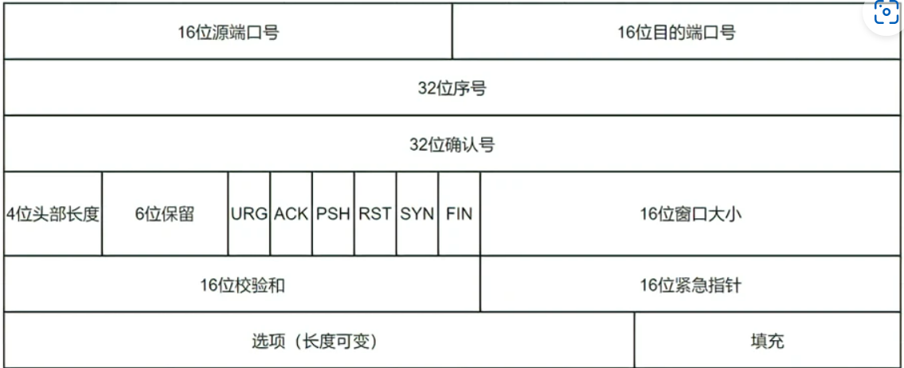

# 计算机网络

## 辅助资料

：[计算机网络高频面试题（2022最新版） - 哔哩哔哩 (bilibili.com)](https://www.bilibili.com/read/cv17913969?spm_id_from=333.999.0.0)

## 1.计算机网络相关面试题（网络编程）

### 1.tcp可靠性如何体现

------

**TCP 是通过序列号、确认应答、重发控制、连接管理以及窗口控制等机制实现可靠性传输的。**

##### 1. ARQ协议**，(ARQ包括停止等待ARQ和连续ARQ)

**1.1 停止等待ARQ**

每发完一个分组就停下来等待，等待接收方传回ACK的确认。如果过了一段时间没有得到ACK的确认，就重新发送。如果收到确认就发下一个分组。
受到多方因素影响，接收方收到数据后，返回的ACK确认会丢失，这个时候发送方会重发数据，在停止等待ARQ中，接收方如果会丢弃掉重复的数据
这种方式简单，但是每发一次就停一下，信道利用率很低

**1.2 连续ARQ**

在发送方维持一个发送窗口，在窗口内的分组可以连续发送而不用等待确认。接收方采用累计确认，对按序到达的最后一个分组返回发送确认消息，表明到这个分组为止所有的分组都正确收到了。
这被称为go-back-N，表示需要退回来冲重传已经发过的N个消息

##### 二 流量控制（滑动窗口RWND）

目的
经过以上场景，我们就知道流量控制的目的了，**实际上是为了照顾接收方的接收速度而控制发送方的发送速度**。。

手段
那如何控制这个发送速度呢？就需要使用到滑动窗口了。我们在发送发确认两个参数：最后一次发送的字节位置和最后一次收到ACK的字节位置，在接收方也确认两个位置：最后一次接收的字节码位置，最后一次字节码写入的位置。我们只需要确认这个滑动窗口大小。在发送方和接收方控制两个位置的差值不超过滑动窗口即可，而实际上这边的滑动窗口就是一个值而已，一个差值。

##### 三 拥塞控制（拥塞窗口CWND）

场景和目的
**和流量控制不同，拥塞控制的目的是为了缓解网络压力，而流量控制是为了缓解接收方压力。**网络为什么会有压力呢？数据包在网络中传输的时候，就拿路由器来说，涉及到路由选择和转发，每个路由器都维护一张转发表，每个数据包都是通过路由器转发表的索引去转发，那必然会有缓存缓存数据包，那如果发送速度过快，就会导致缓存泄露，数据丢失的可能性，这就是网络压力的表现之一

手段
因此我们发送方除了维护滑动窗口外，还要维护一个拥塞窗口，拥塞窗口的大小由什么决定呢？其实就是由丢包与否决定，发送发发送数据后，定期得不到ACK确认，那么发送方会默认网络拥塞导致包丢失，这个时候就降低拥塞窗口大小，如果能得到ACK确认，那么增加拥塞窗口大小。但是我们需要使发送方最后一次发送的位置到最后一次接收到ACK确认的位置的长度小于拥塞窗口和滑动窗口的较小值。

拥塞控制算法
以上我们所说的控制拥塞窗口大小只是一个大概的思,路，实际上tcp的拥塞控制有四种算法：

慢开始：先将拥塞窗口大小设置为1，在获取ACK顺利的情况下每次拓宽2倍
拥塞避免：让拥塞窗口大小每次增1
快重传：收到三次重复数据包的ACK后，立刻重新发送该数据包后面一个数据包
快恢复：快重传之后直接从阈值开始增加拥塞窗口大小

### 2.计算机网络七层协议

------

应用层

表示层

会话层

传输层

网际层

数据链路层

物理层

### 3.tcp和udp区别

------

| 区别               | TCP                                                          | UDP                                                       |
| ------------------ | ------------------------------------------------------------ | --------------------------------------------------------- |
| 连接               | TCP 是面向连接的传输层协议，传输数据前先要建立连接。         | UDP 是不需要连接，即刻传输数据                            |
| 服务对象           | TCP 是一对一的两点服务，即一条连接只有两个端点               | UDP 支持一对一、一对多、多对多的交互通信                  |
| 可靠性             | TCP 是可靠                                                   | UDP 是尽最大努力交付，不保证可靠交付数据                  |
| 拥塞控制、流量控制 | TCP 有拥塞控制和流量控制机制                                 | UDP 则没有，即使网络非常拥堵了，也不会影响 UDP 的发送速率 |
| 首部开销           | TCP 首部长度较长，首部在没有使用「选项」字段时是 `20` 个字节，如果使用了「选项」字段则会变长的 | UDP 首部只有 8 个字节，并且是固定不变的，开销较小         |
| 传输方式           | TCP 是流式传输，没有边界，但保证顺序和可靠                   | UDP 是一个包一个包的发送，是有边界的，但可能会丢包和乱序  |
| 分片不同           | 在传输层进行分片                                             | 在 IP 层进行分片                                          |

**TCP 和 UDP 应用场景：**

由于 TCP 是面向连接，能保证数据的可靠性交付，因此经常用于：

- `FTP` 文件传输；
- HTTP / HTTPS；

由于 UDP 面向无连接，它可以随时发送数据，再加上 UDP 本身的处理既简单又高效，因此经常用于：

- 包总量较少的通信，如 `DNS` 、`SNMP` 等；
- 视频、音频等多媒体通信；
- 广播通信；

### 4.描述三次握手与四次挥手

------

##### 三次握手：

- 一开始，客户端和服务端都处于 `CLOSE` 状态。服务端主动监听某个端口，处于 `LISTEN` 状态。
- 客户端会随机初始化序号（`client_isn`），将此序号置于 TCP 首部的「序号」字段中，同时把 `SYN` 标志位置为 `1`，表示 `SYN` 报文。接着把第一个 SYN 报文发送给服务端，表示向服务端发起连接，该报文不包含应用层数据，之后客户端处于 `SYN-SENT` 状态。
- 服务端收到客户端的 `SYN` 报文后，首先服务端也随机初始化自己的序号（`server_isn`），将此序号填入 TCP 首部的「序号」字段中，其次把 TCP 首部的「确认应答号」字段填入 `client_isn + 1`, 接着把 `SYN` 和 `ACK` 标志位置为 `1`。最后把该报文发给客户端，该报文也不包含应用层数据，之后服务端处于 `SYN-RCVD` 状态。
- 客户端收到服务端报文后，还要向服务端回应最后一个应答报文，首先该应答报文 TCP 首部 `ACK` 标志位置为 `1` ，其次「确认应答号」字段填入 `server_isn + 1` ，最后把报文发送给服务端，这次报文可以携带客户到服务端的数据，之后客户端处于 `ESTABLISHED` 状态。
- 服务端收到客户端的应答报文后，也进入 `ESTABLISHED` 状态。

从上面的过程可以发现**第三次握手是可以携带数据的，前两次握手是不可以携带数据的**，这也是面试常问的题。一旦完成三次握手，双方都处于 `ESTABLISHED` 状态，此时连接就已建立完成，客户端和服务端就可以相互发送数据了。

##### 四次挥手：

1.客户端打算关闭连接，此时会发送一个 TCP 首部 `FIN` 标志位被置为 `1` 的报文，也即 `FIN` 报文，之后客户端进入 `FIN_WAIT_1` 状态。

2.服务端收到该报文后，就向客户端发送 `ACK` 应答报文，接着服务端进入 `CLOSE_WAIT` 状态。

3.客户端收到服务端的 `ACK` 应答报文后，之后进入 `FIN_WAIT_2` 状态。

4.等待**服务端****处理完数据后**，也向客户端发送 `FIN` 报文，之后服务端进入 `LAST_ACK` 状态。

- 客户端收到服务端的 `FIN` 报文后，回一个 `ACK` 应答报文，之后进入 `TIME_WAIT` 状态
- 服务端收到了 `ACK` 应答报文后，就进入了 `CLOSE` 状态，至此服务端已经完成连接的关闭。
- 客户端在经过 `2MSL` 一段时间后，自动进入 `CLOSE` 状态，至此客户端也完成连接的关闭。

每个方向都需要**一个 FIN 和一个 ACK**，因此通常被称为**四次挥手**。

这里一点需要注意是：**主动关闭连接的，才有 TIME_WAIT 状态。**

### 5.tcp如何处理拎包拆包问题

------

TCP 传输协议是面向流的，没有数据包界限，也就是说消息无边界。客户端向服务端发送数据时，可能将一个完整的报文拆分成多个小报文进行发送，也可能将多个报文合并成一个大的报文进行发送。因此就有了拆包和粘包。 在网络通信的过程中，每次可以发送的数据包大小是受多种因素限制的，如 MTU 传输单元大小、滑动窗口等。

具体解释：

(1)接收端只收到一个数据包，由于TCP是不会出现丢包的，所以这一个数据包中包含了发送端发送的两个数据包的信息，这种现象即为粘包。这种情况由于接收端不知道这两个数据包的界限，所以对于接收端来说很难处理。

(2)这种情况有两种表现形式，如下图。接收端收到了两个数据包，但是这两个数据包要么是不完整的，要么就是多出来一块，这种情况即发生了拆包和粘包。这两种情况如果不加特殊处理，对于接收端同样是不好处理的。

由于TCP协议底层无法理解上层的业务数据，所以在底层是无法保证数据包不被拆分和重组的，所以，这个问题只能通过上层的[应用层协议](https://so.csdn.net/so/search?q=应用层协议&spm=1001.2101.3001.7020)设计来解决

（1）消息定长（不够的可以通过补0填充）

（2）自定义协议(小火车)，将消息分为消息头和消息体，消息头中包含消息总长度，这样服务端就可以知道每个数据包的具体长度了，知道了发送数据包的具体边界后，就可以解决粘包和拆包问题了

（3）可以在数据包之间设置边界，如添加特殊符号

### 6.使用socket的时候分为哪几个步骤

------

- 服务端和客户端初始化 `socket`，得到文件描述符；
- 服务端调用 `bind`，将 socket 绑定在指定的 IP 地址和端口;
- 服务端调用 `listen`，进行监听；
- 服务端调用 `accept`，等待客户端连接；
- 客户端调用 `connect`，向服务端的地址和端口发起连接请求；
- 服务端 `accept` 返回用于传输的 `socket` 的文件描述符；
- 客户端调用 `write` 写入数据；服务端调用 `read` 读取数据；
- 客户端断开连接时，会调用 `close`，那么服务端 `read` 读取数据的时候，就会读取到了 `EOF`，待处理完数据后，服务端调用 `close`，表示连接关闭。

这里需要注意的是，服务端调用 `accept` 时，连接成功了会返回一个已完成连接的 socket，后续用来传输数据。

所以，监听的 socket 和真正用来传送数据的 socket，是「两个」 socket，一个叫作**监听 socket**，一个叫作**已完成连接 socket**。

成功连接建立之后，双方开始通过 read 和 write 函数来读写数据，就像往一个文件流里面写东西一样。

### 7.TCP的三次握手,怎么保证通信的安全（加密？）（答案未知）

------

TCP确保传输可靠性的方式**

- **校验和**

TCP校验和是一个端到端的校验和，由发送端计算，然后由接收端验证。其目的是为了发现TCP首部和数据在发送端到接收端之间发生的任何改动。如果接收方检测到校验和有差错，则TCP段会被直接丢弃，重新发送。

发送方：在发送数据之前计算检验和，并进行校验和的填充。
接收方：收到数据后，对数据以同样的方式进行计算，求出校验和，与发送方的进行比对

- **序列号/确认应答**

只要发送端有一个包传输，接收端没有回应确认包（ACK包），都会重发。或者接收端的应答包，发送端没有收到也会重发数据。这就可以保证数据的完整性。

- **超时重传**

TCP在解决这个问题的时候引入了一个新的机制，叫做超时重传机制。简单理解就是发送方在发送完数据后等待一个时间，时间到达没有接收到ACK报文，那么对刚才发送的数据进行重新发送。如果是刚才第一个原因，接收方收到二次重发的数据后，便进行ACK应答。如果是第二个原因，接收方发现接收的数据已存在（判断存在的根据就是序列号，所以上面说序列号还有去除重复数据的作用），那么直接丢弃，仍旧发送ACK应答。

- **连接管理**

[三次握手](https://so.csdn.net/so/search?q=三次握手&spm=1001.2101.3001.7020)与四次挥手

- **流量控制（滑动窗口控制）**

- **拥塞控制**

### 8.TCP三次握手四次挥手，还有2msl，必问，必须会

------

三次握手与四次挥手在上面回答了，这里回答2msl

**TTL 的值一般是 64，Linux 将 MSL 设置为 30 秒，意味着 Linux 认为数据报文经过 64 个路由器的时间不会超过 30 秒，如果超过了，就认为报文已经消失在网络中了**。

TIME_WAIT 等待 2 倍的 MSL，比较合理的解释是： 网络中可能存在来自发送方的数据包，当这些发送方的数据包被接收方处理后又会向对方发送响应，所以**一来一回需要等待 2 倍的时间**。

可以看到 **2MSL时长** 这其实是相当于**至少允许报文丢失一次**。比如，若 ACK 在一个 MSL 内丢失，这样被动方重发的 FIN 会在第 2 个 MSL 内到达，TIME_WAIT 状态的连接可以应对。

`2MSL` 的时间是从**客户端接收到 FIN 后发送 ACK 开始计时的**。如果在 TIME-WAIT 时间内，因为客户端的 ACK 没有传输到服务端，客户端又接收到了服务端重发的 FIN 报文，那么 **2MSL 时间将重新计时**。

### 9      tcp和udp的区别？

------

已答

### 10      tcp三次握手建立连接的过程？三次握手过程通信双方各自的状态？

------

### 11      tcp通信过程的状态是如何变化的

------

已答

### 12     从实用的角度来讲，三次握手的真实目的？（从硬件的角度来看，每一次握手的意义？）

------

原因一：防止**历史连接**

使用三次握手建立连接的**最主要原因就是防止「历史连接」初始化了连接**。

*原因二：同步双方初始序列号*

*原因三：避免资源浪费*

如果只有「两次握手」，当客户端发生的 `SYN` 报文在网络中阻塞，客户端没有接收到 `ACK` 报文，就会重新发送 `SYN` ，**由于没有第三次握手，服务端不清楚客户端是否收到了自己回复的 ACK 报文，所以服务端每收到一个 SYN 就只能先主动建立一个连接**，这会造成什么情况呢？

如果客户端发送的 `SYN` 报文在网络中阻塞了，重复发送多次 `SYN` 报文，那么服务端在收到请求后就会**建立多个冗余的无效链接，造成不必要的资源浪费。**即两次握手会造成消息滞留情况下，服务端重复接受无用的连接请求 `SYN` 报文，而造成重复分配资源

***小结***

TCP 建立连接时，通过三次握手**能防止历史连接的建立，能减少双方不必要的资源开销，能帮助双方同步初始化序列号**。序列号能够保证数据包不重复、不丢弃和按序传输。

不使用「两次握手」和「四次握手」的原因：

- 「两次握手」：无法防止历史连接的建立，会造成双方资源的浪费，也无法可靠的同步双方序列号；
- 「四次握手」：三次握手就已经理论上最少可靠连接建立，所以不需要使用更多的通信次数。

### 13      四次挥手释放连接时，等待2MSL的意义?

------

已答

### 14      网络的七层模型？每一层的协议？

------

**第七层:应用层**

提供各种各样的应用层协议,为用户与网络之间提供一个打交道的接口

TELENT,DNS,HTTP,HTTPS,FTP,NFS

**第六层:表示层**

统一数据格式,从而使得数据能在两个系统中传输。

常见协议:LPP

**第五层:会话层**

:负责应用程序之间建立、维持和中断会话，同时也提供对设备和结点之间的会话控制，协调系统和服务之间的交流

常见协议:LDAP

**第四层:传输层**

常见协议:TCP,UDP,TLS

**第三层:网络层**

常见协议:IP,ICMP,ICMPv6,ARP,RARP

**第二层:数据链路层**

常见协议:VLAN,STP,IEEE 802.3,WIFI(IEEE 802.11),ATM,HDLC,PPP

**第一层:物理层**

### 15      TCP粘包问题是什么？你会如何去解决它？

------

TCP 传输协议是面向流的，没有数据包界限，也就是说消息无边界。客户端向服务端发送数据时，可能将一个完整的报文拆分成多个小报文进行发送，也可能将多个报文合并成一个大的报文进行发送。因此就有了拆包和粘包。

小火车

### 16、      为什么TIME_WAIT状态需要经过2MSL才能返回到CLOSE状态

------

已答

### 17、      TCP 利用滑动窗口实现流量控制的机制？

------

窗口大小就是指**无需等待确认应答，而可以继续发送数据的最大值**

窗口大小由哪一方决定？TCP 头里有一个字段叫 `Window`，也就是窗口大小。

**这个字段是接收端告诉发送端自己还有多少缓冲区可以接收数据。于是发送端就可以根据这个接收端的处理能力来发送数据，而不会导致接收端处理不过来。**

发送方发送的数据大小不能超过接收方的窗口大小，否则接收方就无法正常接收到数据。

**发送方的滑动窗口**

- `SND.WND`：表示发送窗口的大小（大小是由接收方指定的）；
- `SND.UNA`（*Send Unacknoleged*）：是一个绝对指针，它指向的是已发送但未收到确认的第一个字节的序列号，也就是 #2 的第一个字节。
- `SND.NXT`：也是一个绝对指针，它指向未发送但可发送范围的第一个字节的序列号，也就是 #3 的第一个字节。
- 指向 #4 的第一个字节是个相对指针，它需要 `SND.UNA` 指针加上 `SND.WND` 大小的偏移量，就可以指向 #4 的第一个字节了。

那么可用窗口大小的计算就可以是：

**可用窗口大小 = SND.WND -（SND.NXT - SND.UNA）**

**接收方的滑动窗口**

并不是完全相等，接收窗口的大小是**约等于**发送窗口的大小的

##### **流量控制**

发送方不能无脑的发数据给接收方，要考虑接收方处理能力。

如果一直无脑的发数据给对方，但对方处理不过来，那么就会导致触发重发机制，从而导致网络流量的无端的浪费。

为了解决这种现象发生，**TCP 提供一种机制可以让「发送方」根据「接收方」的实际接收能力控制发送的数据量，这就是所谓的流量控制。**

### 18、      TCP的三次握手

------

已答

### 19、      为什么需要三次握手，两次握手行不行

------

TCP三次握手的原因是：

- 三次握手才可以阻止重复历史连接的初始化（主要原因）
- 三次握手才可以同步双方的初始序列号
- 三次握手才可以避免资源浪费

1    那为什么 TCP 两次握手为什么无法阻止历史连接呢？ 

主要是因为**在两次握手的情况下，服务端没有中间状态给客户端来阻止历史连接，导致服务端可能建立一个历史连接，造成资源浪费**

2 	而两次握手只保证了一方的初始序列号能被对方成功接收，没办法保证双方的初始序列号都能被确认接收。

3	如果只有「两次握手」，当客户端发生的 `SYN` 报文在网络中阻塞，客户端没有接收到 `ACK` 报文，就会重新发送 `SYN` ，**由于没有第三次握手，服务端不清楚客户端是否收到了自己回复的 ACK 报文，所以服务端每收到一个 SYN 就只能先主动建立一个连接**，这会造成什么情况呢？

如果客户端发送的 `SYN` 报文在网络中阻塞了，重复发送多次 `SYN` 报文，那么服务端在收到请求后就会**建立多个冗余的无效链接，造成不必要的资源浪费。**

### 20、      为什么需要四次挥手

------

##### 为什么挥手需要四次？

再来回顾下四次挥手双方发 `FIN` 包的过程，就能理解为什么需要四次了。

- 关闭连接时，客户端向服务端发送 `FIN` 时，仅仅表示客户端不再发送数据了但是还能接收数据。
- 服务端收到客户端的 `FIN` 报文时，先回一个 `ACK` 应答报文，而服务端可能还有数据需要处理和发送，等服务端不再发送数据时，才发送 `FIN` 报文给客户端来表示同意现在关闭连接。

从上面过程可知，服务端通常需要等待完成数据的发送和处理，所以服务端的 `ACK` 和 `FIN` 一般都会分开发送，因此是需要四次挥手。

但是**在特定情况下，四次挥手是可以变成三次挥手的**

##### 第一次挥手丢失了，会发生什么？

如果第一次挥手丢失了，那么客户端迟迟收不到被动方的 ACK 的话，也就会触发超时重传机制，重传 FIN 报文，重发次数由 `tcp_orphan_retries` 参数控制。

当客户端重传 FIN 报文的次数超过 `tcp_orphan_retries` 后，就不再发送 FIN 报文，则会在等待一段时间（时间为上一次超时时间的 2 倍），如果还是没能收到第二次挥手，那么直接进入到 `close` 状态。

##### 第二次挥手丢失了，会发生什么？

当服务端收到客户端的第一次挥手后，就会先回一个 ACK 确认报文，此时服务端的连接进入到 `CLOSE_WAIT` 状态。

ACK 报文是不会重传的，所以如果服务端的第二次挥手丢失了，客户端就会触发超时重传机制，重传 FIN 报文，直到收到服务端的第二次挥手，或者达到最大的重传次数。

##### 第三次挥手丢失了，会发生什么？

服务端处于 CLOSE_WAIT 状态时，调用了 close 函数，内核就会发出 FIN 报文，同时连接进入 LAST_ACK 状态，等待客户端返回 ACK 来确认连接关闭。

如果迟迟收不到这个 ACK，服务端就会重发 FIN 报文，重发次数仍然由 `tcp_orphan_retrie`s 参数控制，这与客户端重发 FIN 报文的重传次数控制方式是一样的。如果还是没能收到客户端的第四次挥手（ACK报文），那么服务端就会断开连接。

客户端因为是通过 close 函数关闭连接的，处于 FIN_WAIT_2 状态是有时长限制的，如果 tcp_fin_timeout 时间内还是没能收到服务端的第三次挥手（FIN 报文），那么客户端就会断开连接

##### 第四次挥手丢失了，会发生什么？

如果第四次挥手的 ACK 报文没有到达服务端，服务端就会重发 FIN 报文，重发次数仍然由前面介绍过的 `tcp_orphan_retries` 参数控制。

客户端在收到第三次挥手后，就会进入 TIME_WAIT 状态，开启时长为 2MSL 的定时器，如果途中再次收到第三次挥手（FIN 报文）后，就会重置定时器，当等待 2MSL 时长后，客户端就会断开连

### 21、      为什么需要 TIME_WAIT 状态，该状态可以没有吗？

------

主动发起关闭连接的一方，才会有 `TIME-WAIT` 状态。

需要 TIME-WAIT 状态，主要是两个原因：

***原因一：防止历史连接中的数据，被后面相同四元组的连接错误的接收***

- 服务端在关闭连接之前发送的 `SEQ = 301` 报文，被网络延迟了。
- 接着，服务端以相同的四元组重新打开了新连接，前面被延迟的 `SEQ = 301` 这时抵达了客户端，而且该数据报文的序列号刚好在客户端接收窗口内，因此客户端会正常接收这个数据报文，但是这个数据报文是上一个连接残留下来的，这样就产生数据错乱等严重的问题。

为了防止历史连接中的数据，被后面相同四元组的连接错误的接收，因此 TCP 设计了 TIME_WAIT 状态，状态会持续 `2MSL` 时长，这个时间**足以让两个方向上的数据包都被丢弃，使得原来连接的数据包在网络中都自然消失，再出现的数据包一定都是新建立连接所产生的。**

***原因二：保证「被动关闭连接」的一方，能被正确的关闭***

TIME-WAIT 作用是**等待足够的时间以确保最后的 ACK 能让被动关闭方接收，从而帮助其正常关闭。**

如果客户端（主动关闭方）最后一次 ACK 报文（第四次挥手）在网络中丢失了，那么按照 TCP 可靠性原则，服务端（被动关闭方）会重发 FIN 报文。

假设客户端没有 TIME_WAIT 状态，而是在发完最后一次回 ACK 报文就直接进入 CLOSE 状态，如果该 ACK 报文丢失了，服务端则重传的 FIN 报文，而这时客户端已经进入到关闭状态了，在收到服务端重传的 FIN 报文后，就会回 RST 报文。

服务端收到这个 RST 并将其解释为一个错误（Connection reset by peer），这对于一个可靠的协议来说不是一个优雅的终止方式。

为了防止这种情况出现，客户端必须等待足够长的时间，确保服务端能够收到 ACK，如果服务端没有收到 ACK，那么就会触发 TCP 重传机制，服务端会重新发送一个 FIN，这样一去一来刚好两个 MSL 的时间。

客户端在收到服务端重传的 FIN 报文时，TIME_WAIT 状态的等待时间，会重置回 2MSL。

### 22、      什么是 TCP 的“粘包”问题？怎么解决？

------

已答

### 23   		什么是TCP的TIME_WAIT,CLOSE_WAIT状态？

------

已答

### 24 		说说TCP报文首部有哪些字段，其作用又分别是什么？

16位端口号：源端口号，主机该报文段是来自哪里；目标端口号，要传给哪个上层协议或应用程序

32位序号：一次TCP通信（从TCP连接建立到断开）过程中某一个传输方向上的字节流的每个字节的编号。

32位确认号：用作对另一方发送的tcp报文段的响应。其值是收到的TCP报文段的序号值加1。

4位头部长度：表示tcp头部有多少个32bit字（4字节）。因为4位最大能标识15，所以TCP头部最长是60字节。

6位标志位：URG(紧急指针是否有效)，ACk（表示确认号是否有效），PSH（缓冲区尚未填满），RST（表示要求对方重新建立连接），SYN（建立连接消息标志接），FIN（表示告知对方本端要关闭连接了）

16位窗口大小：是TCP流量控制的一个手段。这里说的窗口，指的是接收通告窗口。它告诉对方本端的TCP接收缓冲区还能容纳多少字节的数据，这样对方就可以控制发送数据的速度。

16位校验和：由发送端填充，接收端对TCP报文段执行CRC算法以检验TCP报文段在传输过程中是否损坏。注意，这个校验不仅包括TCP头部，也包括数据部分。这也是TCP可靠传输的一个重要保障。

16位紧急指针：一个正的偏移量。它和序号字段的值相加表示最后一个紧急数据的下一字节的序号。因此，确切地说，这个字段是紧急指针相对当前序号的偏移，不妨称之为紧急偏移。TCP的紧急指针是发送端向接收端发送紧急数据的方法。