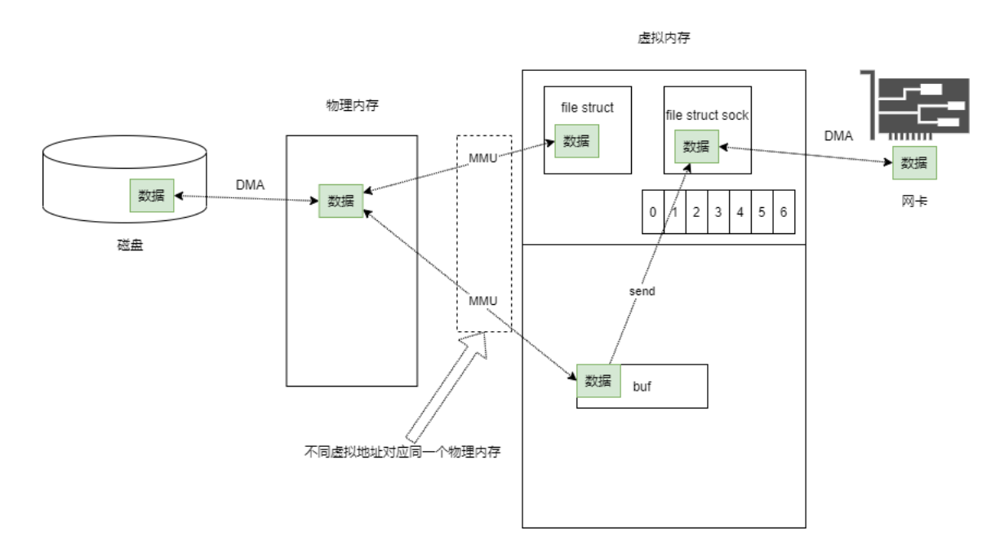

## 6.星空**

### 1.sizeof和strlen的区别

sizeof是运算符，strlen是库函数

sizeof是在编译时得到的

sizeof的参数可以是任意的数据类型，strlen的参数必须是字符指针，且结尾是'\0'的字符串

sizeof不能用来得到动态分配存储空间的大小

### 2.头文件多次调用的重定义有哪些方式避免？从代码层面来讲

\#ifndef

\#define

\#endif

使用pragma once编译指令

将声明和定义分开

### 3.linux查看磁盘空间

free

df -h

du -cc/*


### 4.linux的0号，1号，2号进程

0号(idle)：由系统自动创建

1号(init)：由0号线程创建,是所有其他用户进程的祖先进程。

2号(kthredd)：由0号进程进行创建，用来管理和调度其他内核线程。


### 5.using的用法

1命名空间的使用

2在子类中引用基类的成员

3别名的指定


跟typedef的区别：

using可以给模板起别名


### 6.gdb中r和c区别

r就是让程序跑起来

c就是从一个断点跑到另一个断点

### 7.gdb中n和s的qubie

如果碰到函数，想进入函数内部，要用s，其他情况两个一样。


### 8.如何用gdb调试正在运行的程序

找进程号，然后用attache指令

完成调试后用detach指令

### 9.如何防止死锁

1.死锁预防

2.死锁避免

3.死锁检测和解除


### 11。UTF-8中文占几个字节，中文前8位是什么？

占三个字节

1110xxxx 10xxxxxx 10xxxxxx


### 12工作使用的gdb命令

第一步： g++ xx.c -o main **-g**

第二步： gdb ./main

第三步： r 开始运行程序

l  (list显示代码)

s （单步调试）

c    (继续)

n    (下一步)

p    (打印变量)

### 13在使用gdb时，怎么查看程序出错的堆栈信息

bt

从下向上看

### 14使用mmap技术时，mmap主要使用在哪层？（？？？不清楚）




mmap技术应用在应用层和内核层之间。

在内核层，mmap技术可以将内存页面从物理层映射到虚拟内存，从而实现内存管理。

在应用层，mmap技术可以将文件映射到用户空间，从而实现文件访问的功能


使用 mmap 系统调用只能减少数据从磁盘文件的文件对象到用户态空间的拷贝，但是依然无法避免从用户态到内核已连接套接字的拷贝


### 15简述epoll的使用，epoll的两种模式

水平触发：只有这个内核缓冲区非空，有数据可以读取，就一直发出可读信号进行通知

边缘触发：当文件描述符关联的读内核缓冲区由空转为非空的瞬间，发出可读信号

### 17说一下struct和class的区别

struct成员默认权限是public，class默认权限是private，实际class底层由struct实现

### 18查看内核

uname -r

### 19如何检测内存泄漏

valgrind

举例子：

$:  valgrind --leak-check=full ./program_name

### 20如何查看进程

ps

ps -aux 查看所有进程的完整信息

### 21如何查看网络连接情况

netstat

### 22free命令

free命令可以显示内存使用情况

使用方法为 ：free [options]

### 23编译时如何连接一个第三方库

链接时 -l+库名   l是小写

### 24如何调试程序

gdb

### 25gdb打断点

b

```
27多线程如何查看堆栈（非异常情况）
```

不会直接摆：<https://www.cnblogs.com/lidabo/p/5629830.html>

您可以使用**info threads**命令来显示所有活动线程的信息。

您可以使用thread+id命令来选择某个特定的线程，

然后使用bt (backtrace)命令来查看该线程的堆栈。

 你也可以使用info stack来查看整个进程的堆栈信息。

### 28通常网络通信的协议

JSON、XML

### 31如何避免死锁

四个条件

1.互斥条件，一个资源每次只能被一个进程使用

2.请求与保持：一个进程因请求资源而阻塞时，对已获得资源保持不放

3.不剥夺：进程获得的资源，在未使用完之前，不能强行剥夺

4.循环等待条件:若干进程之间形成一种循环等待资源关系

### 34 epoll的实现步骤

epoll的实现步骤主要包括如下几步：

1. 创建epoll句柄：调用epoll_create()函数创建epoll句柄，该函数返回一个指向epoll结构的指针。

2. 向epoll注册事件：调用epoll_ctl()函数向epoll结构添加文件描述符，并指定监听的事件类型。

3. 等待事件的发生：调用epoll_wait()函数等待事件的发生，当事件发生时，epoll_wait()函数返回，程序继续执行。

4. 处理发生的事件：当epoll_wait()函数返回时，根据返回值确定发生了什么事件，并作出相应处理。

5. 关闭epoll句柄：调用close()函数关闭epoll句柄，释放资源。

   

### 38条件变量的使用？

第一步：先pthread_mutex_lock先上锁

第二步：声明pthread_cond变量

第三步：使用pthread_cond_init函数来初始化该变量

第四步：调用pthread_cond_signal或pthread_cond_wait函数来实现线程间的同步。


### 39 Linux上查看内存、磁盘、CPU占用的命令？

linux上

查看内存占用的命令是free

查看磁盘占用的命令是df

查看cpu占用的命令是top

### 40怎么应对死锁，怎么找到死锁的地方？

你可以使用命令“ps -ef | grep -i deadlock”来查找可能发生死锁的进程


### 41怎么规避内存泄漏的问题？

有malloc就有free

有new就有delete

RAII自动释放资源

使用引用计数来检测和释放内存，从而减少内存泄漏的可能性


1. 使用内存管理工具来检测内存泄漏；
2. 避免使用全局变量；
3. 尽可能使用局部变量，并在不使用时正确释放；
4. 使用对象池管理资源；
5. 使用引用计数法进行资源管理；
6. 避免循环引用；
7. 使用容器类进行资源管理，在销毁时正确释放；
8. 尽量使用自动垃圾回收机制来管理内存

### 42malloc申请内存后，怎么保证一定申请到了呢？你会申请完了后直接使用这片内存吗？

malloc函数会返回一个指针，如果这个指针不为NULL，则表示申请到了内存。

申请到内存之后，需要先对内存进行初始化，然后再使用

### 43解释一下epoll多路复用，是否了解epoll的水平触发和边缘触发？

水平触发：只要对应的文件描述符的读缓冲区有内容，就一直发送读信号

边缘触发：文件描述的都缓冲区从空转为不空的一瞬间，发送读信号。


### 44Linux下有哪些文件类型？

文本文件(.txt)、可执行文件(.exe)、图片文件(.jpg、.png)、视频文件(.mp4、.avi)、音频文件(.mp3、.wav)、字体文件(.ttf、.otf)、文档文件(.doc、.pdf、.xls)和压缩文件(.zip、.rar

### 45说一下你了解的进程间通信？

不同进程间在不同主机之间发送和接受数据的技术。

可以用来实现多个进程之间的通信和协作。


### 48线程同步？

线程同步是指**多个线程之间对共享资源的访问控制**，以保证线程之间的协调，以便实现多线程程序的正确性。通过互斥机制来实现


### 50如何确认线程状态？

确认线程状态的方法有很多种，主要有以下几种：

1.使用Thread.getState()方法查询线程状态；

2.使用Thread.isAlive()方法检查线程是否活动；

3.使用Thread.interrupt()方法中断线程；

4.使用Thread.join()方法来等待线程终止；

5.使用Thread.yield()方法改变线程的优先级；

6.使用Thread.sleep()方法让线程休眠。


### 53缓存和数据库如何实现同步操作

缓存和数据库可以通过消息队列或者中间件来实现同步操作。

例如，应用可以将更新操作发送到消息队列中，然后缓存和数据库可以消费消息，从而实现同步更新


### 54select和epoll的区别？

select和epoll都是I/O多路复用的技术。

select：它有一个主循环，在每次迭代中都会遍历所有的文件描述符，检查其是否有新的I/O事件发生，这样就会造成大量的不必要的检查，当文件描述符数量多时，效率就会很低。

epoll：与select不同，epoll是一种非阻塞式I/O多路复用，它不会在每次迭代中检查所有的文件描述符，而是让用户告诉内核需要监控的文件描述符，当文件描述符的状态发生变化时，内核会通知用户进程，这样用户进程就只需要关注感兴趣的文件描述符，大大提高了效率。

| select           | epoll              |
| ---------------- | ------------------ |
| 阻塞式IO多路复用 | 非阻塞式IO多路复用 |
|                  |                    |
|                  |                    |


### 55讲一下线程池？什么是线程安全？

线程池是一种管理线程的机制，它可以创建线程，处理线程，分配线程任务，回收线程。

线程安全是指多个线程可以安全地共享同一个资源，而不会发生冲突。确保程序在多线程环境下正确运行。

### 56线程池有什么好处？

1. 线程池可以**提高系统的整体性能**，减少资源消耗和创建销毁线程的开销。
2. 线程池可以**更好地控制线程的数量**，防止系统因线程过多而崩溃。
3. 线程池可以**更好地管理线程状态**，如活动线程的数量，队列中的任务数量等。
4. 线程池可以**更好地实现线程的复用**，避免了频繁创建和销毁线程，提高了系统的效率。

### 57动态库与静态库的区别，怎么添加库

动态库和静态库的区别在于，

动态库是一个**可执行文件**，它只在**运行时**加载，

而静态库是一个**静态链接库**，它在**编译时**加载。


### 65socket编程的流程

socket编程的一般流程如下：

1. 创建socket：调用socket()函数；
2. 绑定地址：调用bind()函数；
3. 监听：调用listen()函数；
4. 接受连接：调用accept()函数；
5. 传输数据：调用send()和recv()函数；
6. 关闭socket：调用close()函数。

### 66怎样加快大文件在网络中传输，根据滑动窗口与拥塞控制考虑

通过增加发送方的滑动窗口大小来加速传输，这将允许发送端一次发送更多的数据

采用更有效的拥塞控制算法，允许接收端通知发送端当前网络的拥塞情况，以便发送端可以相应的调整发送速率以减少拥塞


### 68多线程与多进程

多线程是指在同一个地址空间中的一个程序中可以有多个独立的执行线程，每个线程都可以被视为一个单独的进程。多线程可以共享程序的数据，但是每个线程都有自己的运行状态和独立的堆栈。

而多进程是指在计算机系统中，有多个独立的执行序列，每个进程可以有自己独立的地址空间，每个进程可以有自己的数据和程序，但是多个进程之间不能共享数据。


### 73.argv argc怎么用（对应前面发消息的解析）

argv是一个指向字符串数组的指针，其中存放了传递给程序的命令行参数，argc是一个整数，表示传递给程序的命令行参数的个数。argv和argc可以用来在程序中获取传递给程序的命令行参数。

### 74linux文件系统，读入文件的过程

Linux文件系统读入文件的过程主要包括**文件打开**、**文件读取**以及**文件关闭**三个步骤。

首先，文件打开，Linux文件系统会检索文件系统的索引表，以确定文件的位置及其相关的元数据，

其次，文件读取，Linux文件系统会通过根据文件的位置采用相应的磁盘I/O操作读取文件的内容，

最后，文件关闭，Linux文件系统会释放文件的资源，以便其他进程使用。

### 75说说同步、异步、阻塞、非阻塞。

同步：一个操作需要等待另一个操作

异步：一个操作不需要等待另一个擦做

阻塞：一个操作执行时，其他操作都被挂起，直到该操作完成才能继续执行。

非阻塞：一个操作执行时，其他操作可以继续执行不会被挂起，


### 82 epoll和poll的区别

epoll比poll更高效，

因为它只在可能的文件描述符发生变化时才进行检查，

这使得它具有更好的性能。

此外，**poll只能检测少数文件描述符**，而epoll可以检测大量文件描述符。


### 84调用send函数发送数据不全怎么办？

  可以试着重新发送一次，可以尝试把数据分段发送，或者重新调整发送数据的格式。


### 86什么时候分配内存会产生碎片

内存碎片可能在任何时候发生，

但是当你释放内存单元时，它最有可能发生。

当你给一个程序分配内存时，它可能会从一个完整的内存块中分配，

但有时会从一个较小的内存块中分配，从而导致碎片化。


### 90 core文件里有什么？

Core文件里包含了程序开发所需要的源代码文件、静态库文件、头文件和资源文件等文件。

### 91多台节点机之间同时写入数据库会出现什么问题？

可能会出现数据冲突或数据丢失的问题，

。此外，可能会出现数据库性能问题


### 92  讲一下程序的编译步骤

1.预处理：编译器将源代码替换为扩展后的代码，例如宏替换、文件包含等。

 2.编译：编译器将源代码翻译成**汇编代码。**

 3.汇编：汇编器将汇编代码翻译成**机器语言代码（**二进制代码）。

 4.链接：链接器将二进制代码与外部函数库（如C标准库）链接起来，生成**可执行文件**。

###  93进程同步的四种方法？

1.基于信号量的同步方法

2.基于消息传递的同步方法

3.基于文件的同步方法

4.基于管道的同步方法

###    94守护进程、僵尸进程和孤儿进程

1.守护进程是一种后台运行的特殊进程，不受任何用户控制

2.僵尸进程：僵尸进程是指父进程在结束的时候没有调用wait()或waitpid()来收回子进程的资源，而这些子进程仍然处于活动状态，但不占用CPU资源，也不能对外部事件做出反应，称为僵尸进程。

3.孤儿进程：父进程终止时，它的子进程还在运行，子进程此时由系统的Init接管，这样的进程就成为孤儿进程。


###   95 什么时候该用多线程，什么时候该用多进程？

​          多线程适用于实现**多个任务交替执行的场景**，比如游戏中的渲染和计算，或者数据库服务器中的数据库读写。而多进程用于实现**多个任务同时执行的场景**，比如分布式计算，或者多个应用程序同时运行

###   96 进程、线程、协程区别

而协程是一种用户态的轻量级线程，它的特点是不需要操作系统的支持，它在一个线程里面可以被抢占式的调度执行，也就是能够在不同线程之间自由的切换。

### 97  什么是线程安全函数，工作中如何保证线程安全

线程安全函数是指在多线程环境中，同一时刻只允许一个线程进行访问的函数，从而保证线程安全。在工作中，可以使用互斥量、信号量或者原子操作等技术来保证线程安全。

### 98可重入函数是什么意思，为什么一定是线程安全的

可重入函数是指当一个函数正在被调用时，它可以被再次调用，而不会影响函数的正常执行。它是线程安全的，因为它可以在多个线程之间安全地共享，而不会受到线程之间的干扰。

 

 

### 99  Linux程序运行找不到动态库.so文件的三种解决办法

​     待写


​          

​        

### 100  如何根据IP获取对方的MAC地址？ARP协议了解一下

**ARP协议**是用来在IPv4网络中由IP地址获取MAC地址的协议。

它通过在网络中发送ARP请求来获取与IP地址相关联的MAC地址。

当ARP请求发送到网络中时，主机收到该请求后会返回自己的MAC地址，**从而实现通过IP地址获取MAC地址的目的。**


### 101 怎么避免僵尸进程

确保应用程序在正确的时间完成，以避免父进程超时而创建僵尸进程。

通过编写正确的代码来避免子进程出错或异常。
及时杀死僵尸进程，以避免内存泄漏。
尽量使用进程管理器，以保持进程状态。
避免使用长期运行的进程，因为它们很容易变成僵尸进程

### 102 进程间通信接口

进程间通信接口是指程序之间在计算机或网络中进行通信的一种接口。常见的进程间通信接口有包括管道、信号量、消息队列、共享内存等


### 103 进程的六种状态

就绪，运行，阻塞，等待，完成，终止


### 104 进程结束的方式有哪几种？

正常结束，异常结束，被终止

### 106    守护进程与后台进程的区别

守护进程是一类**特殊的后台进程**，它**会一直运行**，

它不像**普通的后台进程一样只在特定的时间运行**，

它的存在主要是为了监视系统运行状态，一旦发现异常就会立刻采取措施进行处理，从而保护系统的安全

### 107 Linux查看内存、端口、进程、线程命令

free

netstat 

ps -aux

ps -elf

### 108 中断和异常的区别

  中断和异常是两个相关的概念，

它们都是程序执行过程中发生的不正常的事件，

中断是一种**外部的异常事件**，

它是由硬件或操作系统发出的，通常是在某种**外部事件发**生时，比如**外部设备发出的中断信**号；

而异常是一种**内部的异常**事件，它是由**程序**本身发出的，通常是在某种**程序出错时**发出的。

